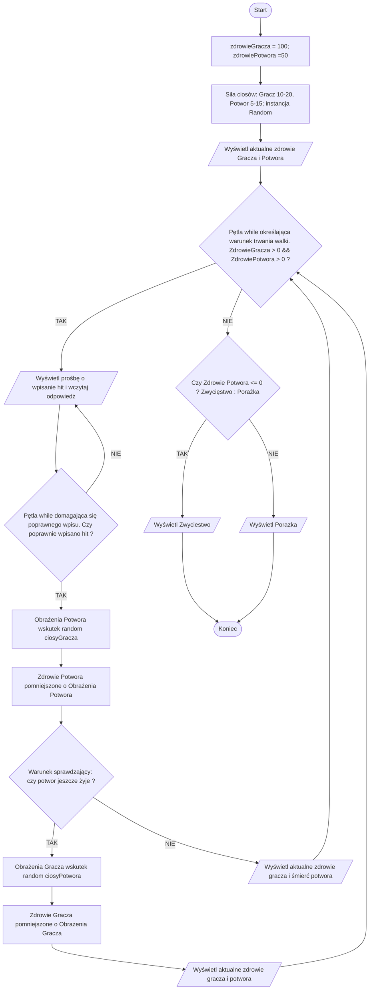

---
puppeteer:
  fullPage: true
---

```mermaid
flowchart TD
    Start(["Start"])
    Zdrowie["zdrowieGracza = 100; zdrowiePotwora =50"]
    Start --> Zdrowie
    SiłaCiosów["Siła ciosów: Gracz 10-20, Potwor 5-15; instancja Random"]
    WyświetlZdrowie[/"Wyświetl aktualne zdrowie Gracza i Potwora"/]
    Zdrowie --> SiłaCiosów
    SiłaCiosów --> WyświetlZdrowie

    Walka{"Pętla while określająca warunek trwania walki. ZdrowieGracza > 0 && ZdrowiePotwora > 0 ?"}
    WyświetlZdrowie --> Walka 

    WpiszHit[/"Wyświetl prośbę o wpisanie hit i wczytaj odpowiedż"/]
    PoprawnośćWpisu{"Pętla while domagająca się poprawnego wpisu. Czy poprawnie wpisano hit ?"}

    Walka -->|TAK| WpiszHit
    WpiszHit --> PoprawnośćWpisu

    PoprawnośćWpisu -->|NIE| WpiszHit

    ObrażeniaPotwora["Obrażenia Potwora wskutek random ciosyGracza"]
    ZdrowiePotwora["Zdrowie Potwora pomniejszone o Obrażenia Potwora"]

    PoprawnośćWpisu -->|TAK| ObrażeniaPotwora
    ObrażeniaPotwora --> ZdrowiePotwora
    
    WarunekKontrataku{"Warunek sprawdzający: czy potwor jeszcze żyje ?"}
    ZdrowiePotwora --> WarunekKontrataku

    ObrażeniaGracza["Obrażenia Gracza wskutek random ciosyPotwora"]
    ZdrowieGracza["Zdrowie Gracza pomniejszone o Obrażenia Gracza"]
    WyświetlAktualneZdrowie[/"Wyświetl aktualne zdrowie gracza i potwora"/]
    WyświetlZwycięstwo[/"Wyświetl aktualne zdrowie gracza i śmierć potwora"/]
    
    WarunekKontrataku -->|TAK| ObrażeniaGracza
    ObrażeniaGracza --> ZdrowieGracza
    ZdrowieGracza --> WyświetlAktualneZdrowie

    WyświetlAktualneZdrowie --> Walka


    WarunekKontrataku -->|NIE| WyświetlZwycięstwo
    WyświetlZwycięstwo --> Walka

    CzySmiercPotwora{"Czy Zdrowie Potwora <= 0 ? Zwycięstwo : Porażka "}
    Zwyciestwo[/"Wyświetl Zwyciestwo"/]
    Porazka[/"Wyświetl Porazka"/]

    Walka -->|NIE| CzySmiercPotwora
    CzySmiercPotwora -->|TAK| Zwyciestwo
    CzySmiercPotwora -->|NIE| Porazka

    Zwyciestwo --> Koniec(["Koniec"])
    Porazka --> Koniec(["Koniec"])

```