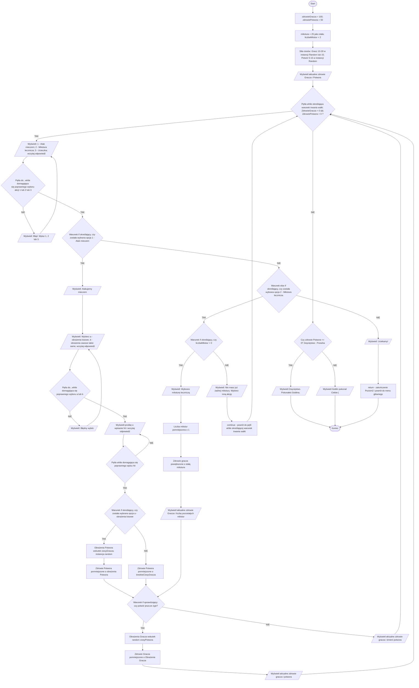

```mermaid
flowchart TD

    Start(["Start"])
    Zdrowie["zdrowieGracza = 100; zdrowiePotwora = 50"]
    Start --> Zdrowie

    Mikstury["mikstura = 25 jako stała; liczbaMikstur = 2"]
    SiłaCiosów["Siła ciosów: Gracz 10-20 w instancji Random lub 15; Potwór 5-15 w instancji Random"]
    WyświetlZdrowie[/"Wyświetl aktualne zdrowie Gracza i Potwora"/]

    Zdrowie --> Mikstury
    Mikstury --> SiłaCiosów
    SiłaCiosów --> WyświetlZdrowie

    Walka{"Pętla while określająca warunek trwania walki. ZdrowieGracza > 0 && ZdrowiePotwora > 0 ?"}
    WyświetlZdrowie --> Walka 

    WybórAkcji[/"Wyświetl: 1 - Atak mieczem; 2 - Mikstura lecznicza; 3 - Ucieczka; wczytaj odpowiedź"/]
    PoprawnośćWyboruAkcji{"Pętla do...while domagająca się poprawnego wyboru akcji 1 lub 2 lub 3"}
    BłędnyWybórAKcji[/"Wyświetl: Błąd. Wpisz 1, 2 lub 3."/]

    Walka -->|TAK| WybórAkcji
    WybórAkcji --> PoprawnośćWyboruAkcji
    PoprawnośćWyboruAkcji -->|NIE| BłędnyWybórAKcji
    BłędnyWybórAKcji --> WybórAkcji

    CzyWyborAkcji1{"Warunek if określający, czy została wybrana opcja 1 - Atak mieczem"}
    PoprawnośćWyboruAkcji -->|TAK| CzyWyborAkcji1

    AtakujemyMieczem[/"Wyświetl: Atakujemy mieczem"/]
    RodzajAtakuMieczem[/"Wyświetl: Wybierz a - obrażenia losowe, b - obrażenia zawsze takie same, wczytaj odpowiedź"/]
    PoprawnośćWyboruAtaku{"Pętla do...while domagająca się poprawnego wyboru a lub b"}
    BłędnyWyborAtaku[/"Wyświetl: Błędny wybór."/]

    CzyWyborAkcji1 --> |TAK| AtakujemyMieczem
    AtakujemyMieczem --> RodzajAtakuMieczem
    RodzajAtakuMieczem --> PoprawnośćWyboruAtaku

    PoprawnośćWyboruAtaku -->|NIE| BłędnyWyborAtaku
    BłędnyWyborAtaku --> RodzajAtakuMieczem

    WpiszHit[/"Wyświetl prośbę o wpisanie hit i wczytaj odpowiedź"/]
    PoprawnośćWpisu{"Pętla while domagająca się poprawnego wpisu hit"}

    PoprawnośćWyboruAtaku -->|TAK| WpiszHit
    WpiszHit --> PoprawnośćWpisu
    PoprawnośćWpisu -->|NIE| WpiszHit

    CzyWyborAtakuA{"Warunek if określający, czy została wybrana opcja a - obrażenia losowe"}
    PoprawnośćWpisu -->|TAK| CzyWyborAtakuA

    ObrażeniaPotwora["Obrażenia Potwora wskutek ciosyGracza; instancja random"]
    ZdrowiePotwora["Zdrowie Potwora pomniejszone o obrażenia Potwora"]
    ZdrowiePotworaS["Zdrowie Potwora pomniejszone o średnieCiosyGracza"]

    CzyWyborAtakuA -->|TAK| ObrażeniaPotwora
    ObrażeniaPotwora --> ZdrowiePotwora
    CzyWyborAtakuA -->|NIE| ZdrowiePotworaS

    CzyWyborAkcji2{"Warunek else if określający, czy została wybrana opcja 2 - Mikstura lecznicza."}
    CzyWyborAkcji1 -->|NIE| CzyWyborAkcji2
    CzySaMikstury{"Warunek if określający, czy liczbaMikstur > 0"}
    CzyWyborAkcji2 -->|TAK| CzySaMikstury

    WybranoMiksture[/"Wyświetl: Wybrano miksturę leczniczą"/]
    LiczbaMikstur["Liczba mikstur pomniejszona o 1"]
    ZdrowieGraczaPoMiksturze["Zdrowie gracza powiększone o stałą mikstura"]
    StanPoMiksturze[/"Wyświetl aktualne zdrowie Gracza i liczbę pozostałych mikstur"/]

    CzySaMikstury -->|TAK| WybranoMiksture
    WybranoMiksture --> LiczbaMikstur
    LiczbaMikstur --> ZdrowieGraczaPoMiksturze
    ZdrowieGraczaPoMiksturze --> StanPoMiksturze

    BrakMikstur[/"Wyświetl: Nie masz już żadnej mikstury. Wybierz inną akcję "/]
    KontynuujWalkę["continue - powrót do pętli while określającej warunek trwania walki"]

    CzySaMikstury -->|NIE| BrakMikstur
    BrakMikstur --> KontynuujWalkę
    KontynuujWalkę --> Walka

    Uciekamy[/"Wyświetl: Uciekamy!"/]
    PowrótDoMenu["return - zakończenie Poziom2 i powrót do menu głównego"]

    CzyWyborAkcji2 -->|NIE| Uciekamy
    Uciekamy --> PowrótDoMenu

    WarunekKontrataku{"Warunek if sprawdzający: czy potwór jeszcze żyje?"}

    ZdrowiePotwora --> WarunekKontrataku
    ZdrowiePotworaS --> WarunekKontrataku
    StanPoMiksturze --> WarunekKontrataku

    ObrazeniaGracza["Obrażenia Gracza wskutek random ciosyPotwora"]
    ZdrowieGracza["Zdrowie Gracza pomniejszone o Obrażenia Gracza"]
    WyswietlAktualneZdrowie[/"Wyświetl aktualne zdrowie gracza i potwora"/]
    WyswietlZwyciestwo[/"Wyświetl aktualne zdrowie gracza i śmierć potwora"/]

    WarunekKontrataku -->|TAK| ObrazeniaGracza
    ObrazeniaGracza --> ZdrowieGracza
    ZdrowieGracza --> WyswietlAktualneZdrowie
    WyswietlAktualneZdrowie --> Walka

    WarunekKontrataku -->|NIE| WyswietlZwyciestwo
    WyswietlZwyciestwo --> Walka

    CzySmiercPotwora{"Czy zdrowie Potwora <= 0? Zwycięstwo : Porażka"}
    Zwyciestwo[/"Wyświetl Zwycięstwo. Pokonałeś Goblina."/]
    Porazka[/"Wyświetl Goblin pokonał Ciebie:("/]

    Walka -->|NIE| CzySmiercPotwora
    CzySmiercPotwora -->|TAK| Zwyciestwo
    CzySmiercPotwora -->|NIE| Porazka

    Zwyciestwo --> Koniec(["Koniec"])
    Porazka --> Koniec(["Koniec"])
    PowrótDoMenu --> Koniec(["Koniec"])
    
```

