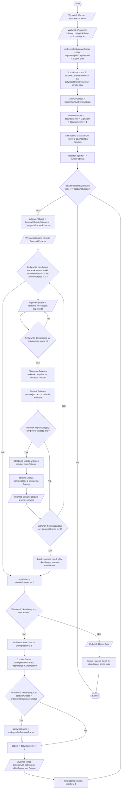

```mermaid
flowchart TD

Start(["Start"])
WybranoWyprawe[/"Wyświetl: Wybrano wyprawę do lochu"/]
ZasadyWyprawy[/"Wyświetl: Zwyciężaj potwory i osiągaj kolejne poziomy w grze."/]

Start --> WybranoWyprawe
WybranoWyprawe --> ZasadyWyprawy

StaleZdrowia["maksymalneZdrowieGracza = 100; regeneracjaPoZwyciestwie = 20 jako stałe"]
StalePotworow["liczbaPotworow = 3; bazoweZdrowiePotwora = 30; przyrostZdrowiaPotwora = 15 jako stałe"]
Zdrowie["zdrowieGracza = maksymalneZdrowieGracza"]
PostepGracza["numerPotwora = 1; doswiadczenie = 0; poziom = doswiadczenie + 1"]
SilaCiosow["Siła ciosów: Gracz 10-20, Potwór 5-15, instancja Random"]

ZasadyWyprawy --> StaleZdrowia
StaleZdrowia --> StalePotworow
StalePotworow --> Zdrowie
Zdrowie --> PostepGracza
PostepGracza --> SilaCiosow

NumerPotwora["Początek pętli for: i = numerPotwora"]
Wyprawa{"Pętla for określająca liczbę walk. i <= liczbaPotworow ?"}

SilaCiosow --> NumerPotwora
NumerPotwora --> Wyprawa

UstalZdrowiePotwora["zdrowiePotwora = bazoweZdrowiePotwora + i * przyrostZdrowiaPotwora"]
WyświetlZdrowie[/"Wyświetl aktualne zdrowie Gracza i Potwora "/]

Wyprawa -->|TAK| UstalZdrowiePotwora
UstalZdrowiePotwora --> WyświetlZdrowie

Walka{"Pętla while określająca warunek trwania walki. zdrowiePotwora > 0 && zdrowieGracza > 0 ?"}
WyświetlZdrowie --> Walka

WpiszHit[/"Wyświetl prośbę o wpisanie hit i wczytaj odpowiedź"/]
PoprawnośćWpisu{"Pętla while domagająca się poprawnego wpisu hit"}

Walka --> WpiszHit
WpiszHit --> PoprawnośćWpisu
PoprawnośćWpisu -->|NIE| WpiszHit

ObrazeniaPotwora["Obrażenia Potwora wskutek ciosyGracza; instancja random"]
ZdrowiePotwora["Zdrowie Potwora pomniejszone o obrażenia Potwora"]

PoprawnośćWpisu -->|TAK| ObrazeniaPotwora
ObrazeniaPotwora --> ZdrowiePotwora

WarunekKontrataku{"Warunek if sprawdzający: czy potwór jeszcze żyje?"}
ZdrowiePotwora --> WarunekKontrataku

ObrazeniaGracza["Obrażenia Gracza wskutek random ciosyPotwora"]
ZdrowieGracza["Zdrowie Gracza pomniejszone o Obrażenia Gracza"]
WyswietlAktualneZdrowie[/"Wyświetl aktualne zdrowie gracza i potwora"/]

WarunekKontrataku -->|TAK| ObrazeniaGracza
ObrazeniaGracza --> ZdrowieGracza
ZdrowieGracza --> WyswietlAktualneZdrowie

CzySmiercGracza{"Warunek if sprawdzający: czy zdrowieGracza <= 0?"}
PrzerwijWalke["break - wyjście z pętli while określającej warunek trwania walki"]

WyswietlAktualneZdrowie --> CzySmiercGracza
WarunekKontrataku -->|NIE| CzySmiercGracza

CzySmiercGracza -->|TAK| PrzerwijWalke
CzySmiercGracza -->|NIE| Walka

WynikWalki["zwyciestwo = zdrowiePotwora <= 0"]
CzyZwyciestwo{"Warunek if okreslający, czy zwyciestwo ?"}

Walka -->|NIE| WynikWalki
PrzerwijWalke --> WynikWalki
WynikWalki --> CzyZwyciestwo

Doswiadczenie["Doświadczenie Gracza powiększono o 1"]
ZdrowieGraczaPoZwyciestwie["Zdrowie Gracza powiększone o stałą regeneracjaPoZwyciestwie"]

CzyZwyciestwo -->|TAK| Doswiadczenie
Doswiadczenie --> ZdrowieGraczaPoZwyciestwie

CzyPrzekroczonoZdrowie{"Warunek if określający, czy zdrowieGracza > maksymalneZdrowieGracza"}
OgraniczenieZdrowiaGracza["zdrowieGracza = maksymalneZdrowieGracza"]
PoziomGracza["poziom = doświadczenie + 1"]

ZdrowieGraczaPoZwyciestwie --> CzyPrzekroczonoZdrowie
CzyPrzekroczonoZdrowie -->|TAK| OgraniczenieZdrowiaGracza
OgraniczenieZdrowiaGracza --> PoziomGracza
CzyPrzekroczonoZdrowie -->|NIE| PoziomGracza

GameOver[/"Wyświetl: Game Over."/]
PrzerwijWyprawe["break - wyjście z pętli for określającej liczbę walk"]

CzyZwyciestwo -->|NIE| GameOver
GameOver --> PrzerwijWyprawe

WyświetlPostep[/"Wyświetl liczbę pokonanych potworów i aktualny poziom Gracza"/]
KolejnyPotwor["i++ - zwiększenie licznika pętli for o 1"]

PoziomGracza --> WyświetlPostep
WyświetlPostep --> KolejnyPotwor
KolejnyPotwor --> Wyprawa

Wyprawa -->|NIE| Koniec(["Koniec"])
PrzerwijWyprawe --> Koniec(["Koniec"])
```

